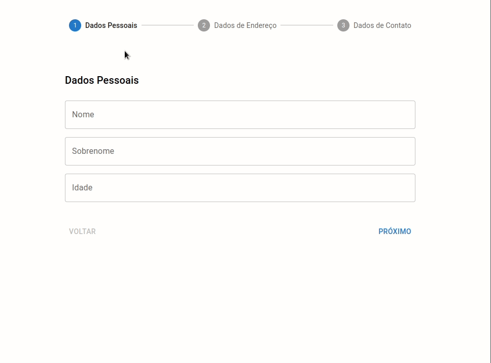
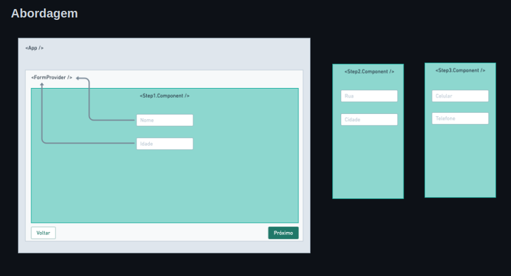

<div align="center" id="top"> 
  

&#xa0;

</div>

<h1 align="center">Criando um form multiStep com React Hook Form v7</h1>

<p align="center">
  

  

  

  

</p>

<p align="center">
  <a href="#dart-about">About</a> &#xa0; | &#xa0; 
  <a href="#sparkles-features">Features</a> &#xa0; | &#xa0;
  <a href="#rocket-technologies">Technologies</a> &#xa0; | &#xa0;
  <a href="#white_check_mark-requirements">Requirements</a> &#xa0; | &#xa0;
  <a href="#checkered_flag-starting">Starting</a> &#xa0; | &#xa0;
  <a href="#memo-license">License</a> &#xa0; | &#xa0;
  <a href="https://github.com/wsasouza" target="_blank">Author</a>
</p>

<br>

## :dart: About

Todo mundo concorda que preencher formulários é muito chato. Mas, é quase impossível deixá-los de lado.

Como podemos então melhorar a experiência para os usuários?

Uma forma é dividir as entradas em várias etapas. Vamos aprender então fazer isso usando uma das melhores formas, vamos combinar o uso do react-hook-form para gerenciar o estado, zod para validação, material ui para a interface e claro, typescript para melhorar a experiência como devs.



## :sparkles: Features

:heavy_check_mark: Captura de dados passo a passo;\
:heavy_check_mark: Visualização do estado de erro do form;\
:heavy_check_mark: Demonstração dos dados submetidos;

## :rocket: Technologies

The following tools were used in this project:

- [React](https://pt-br.reactjs.org/)
- [TypeScript](https://www.typescriptlang.org/)
- [React Hook Form v7](https://react-hook-form.com/)
- [MUI5](https://mui.com/pt/)
- [Zod](https://www.npmjs.com/package/zod)

## :white_check_mark: Requirements

Before starting :checkered_flag:, you need to have [Git](https://git-scm.com) and [Node](https://nodejs.org/en/) installed.

## :checkered_flag: Starting

```bash
# Clone this project
$ git clone https://github.com/wsasouza/poc

# Access
$ cd poc

# Install dependencies
$ yarn

# Run the project
$ yarn start

# The server will initialize in the <http://localhost:3000>
```

## :memo: License

This project is under license from MIT. For more details, see the [LICENSE](LICENSE.md) file.

Made with :heart: by <a href="https://github.com/wsasouza" target="_blank">Walter Santos de Andrade Souza</a>

&#xa0;

<a href="#top">Back to top</a>
